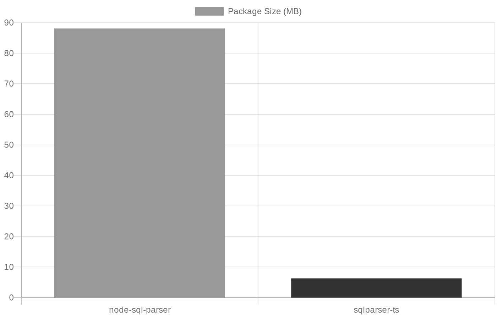
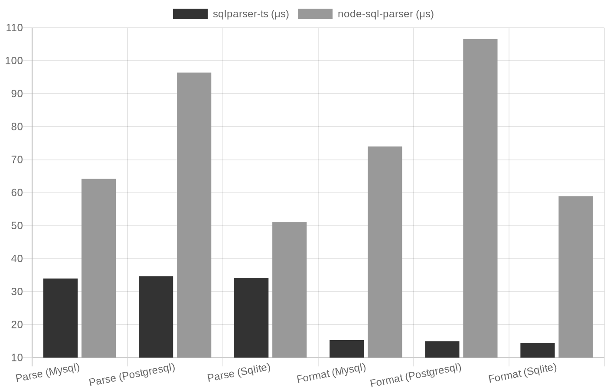

# Benchmark: sqlparser-ts vs node-sql-parser

Performance comparison between **sqlparser-ts** and **node-sql-parser**.

## Summary

| Metric | sqlparser-ts | node-sql-parser | Winner |
|--------|-------------|-----------------|--------|
| Package Size | **6.3 MB** | 88.1 MB | sqlparser-ts (**13.9x smaller**) |
| Parse (avg per call) | **34.3 μs** | 70.6 μs | sqlparser-ts (**2.06x faster**) |
| Format (avg per call) | **14.9 μs** | 79.8 μs | sqlparser-ts (**5.35x faster**) |

## Test Configuration

- **3 Dialects**: MySQL, PostgreSQL, SQLite
- **Comparable methods**: `parse`, `format` (both parsers support)
- **sqlparser-ts only**: `parseToJson`, `parseToString`, `validate`
- **3 Complexity Levels**: Simple (55), Medium (55), Complex (53)
- **163 queries per dialect**
- **10,000 iterations per query**

## Package Size



| Package | Size | Reduction |
|---------|------|-----------|
| node-sql-parser | 88.1 MB | - |
| **sqlparser-ts** | **6.3 MB** | **92.8% smaller** |

## Time by Command and Dialect



| Command | Dialect | sqlparser-ts | Avg/Call | node-sql-parser | Avg/Call | Speedup |
|---------|---------|-------------|----------|-----------------|----------|---------|
| Parse | MySQL | 55,447 ms | 34.0 μs | 104,696 ms | 64.2 μs | **1.89x** |
| Parse | PostgreSQL | 56,611 ms | 34.7 μs | 157,169 ms | 96.4 μs | **2.78x** |
| Parse | SQLite | 55,747 ms | 34.2 μs | 83,347 ms | 51.1 μs | **1.50x** |
| Format | MySQL | 24,944 ms | 15.3 μs | 120,569 ms | 74.0 μs | **4.83x** |
| Format | PostgreSQL | 24,480 ms | 15.0 μs | 173,734 ms | 106.6 μs | **7.10x** |
| Format | SQLite | 23,692 ms | 14.5 μs | 95,950 ms | 58.9 μs | **4.05x** |

| Command (sqlparser-ts only) | MySQL | Avg/Call | PostgreSQL | Avg/Call | SQLite | Avg/Call |
|----------------------------|-------|----------|------------|----------|--------|----------|
| parseToJson | 89,529 ms | 54.9 μs | 91,005 ms | 55.8 μs | 90,896 ms | 55.8 μs |
| parseToString | 23,435 ms | 14.4 μs | 24,369 ms | 15.0 μs | 24,255 ms | 14.9 μs |
| validate | 20,343 ms | 12.5 μs | 21,098 ms | 12.9 μs | 21,499 ms | 13.2 μs |

## Compatibility

Parsing success rate across 163 test queries per dialect:

| Dialect | Level | sqlparser-ts | node-sql-parser |
|---------|-------|--------------|-----------------|
| MySQL | simple | 55/55 (100%) | 55/55 (100%) |
| MySQL | medium | 55/55 (100%) | 55/55 (100%) |
| MySQL | complex | 53/53 (100%) | 49/53 (92%) |
| PostgreSQL | simple | 55/55 (100%) | 53/55 (96%) |
| PostgreSQL | medium | 55/55 (100%) | 55/55 (100%) |
| PostgreSQL | complex | 53/53 (100%) | 52/53 (98%) |
| SQLite | simple | 55/55 (100%) | 54/55 (98%) |
| SQLite | medium | 53/55 (96%) | 52/55 (95%) |
| SQLite | complex | 53/53 (100%) | 33/53 (62%) |

**Key findings:**
- **sqlparser-ts**: Near 100% compatibility across all dialects
- **node-sql-parser**: Struggles with SQLite complex queries (62% success rate)

## CLI Commands

```bash
cd benchmark
npm install

# Run all benchmarks, generate figures and update readme automatically
node cli.js bench

# Individual commands
node cli.js verify              # Compare parser outputs
node cli.js bench -i 100        # Quick benchmark
node cli.js help                # Show help
```

## Conclusion

**sqlparser-ts** significantly outperforms **node-sql-parser**:

| Advantage | Improvement |
|-----------|-------------|
| Package size | **13.9x smaller** (92.8% reduction) |
| Parse speed | **2.06x faster** (average) |
| Format speed | **5.34x faster** (average) |
| Compatibility | **~100%** vs ~90% (node-sql-parser fails on complex SQLite) |

The performance advantage comes from sqlparser-ts being written in Rust and compiled to WebAssembly, providing near-native performance while maintaining a minimal bundle size.
